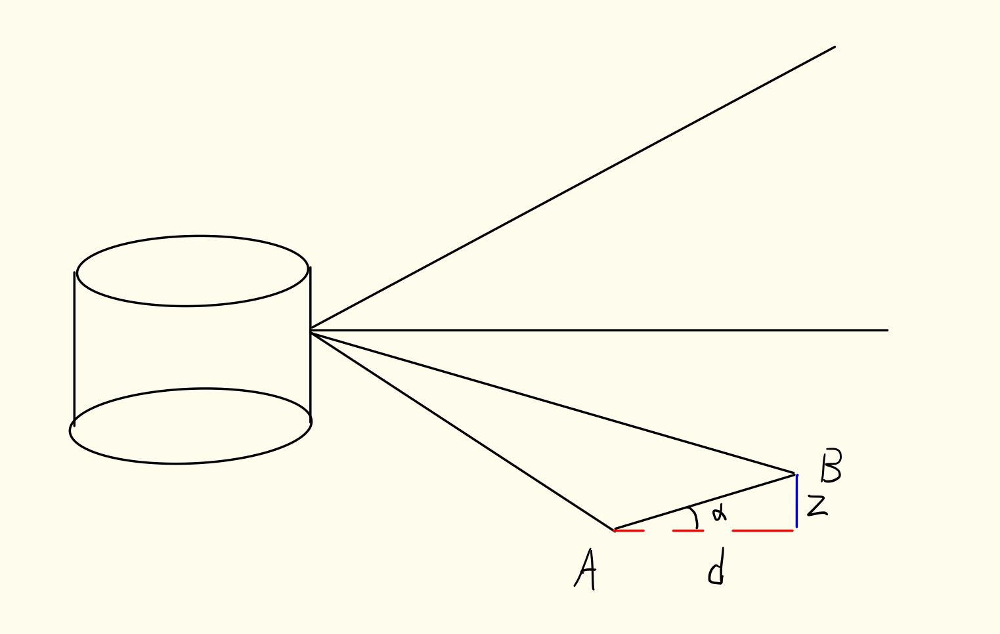
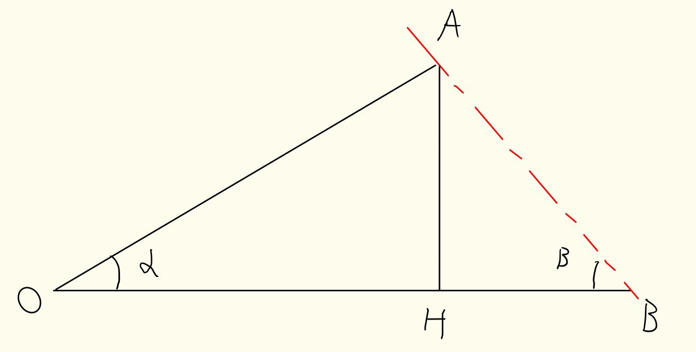

# **论文名称**
LeGO-LOAM:  Lightweight  and  Ground-OptimizedLidar  Odometry  and  Mapping  on  Variable  Terrain
### 作者和是否开源代码
Tixiao Shan and Brendan Englot
开源 lego-loam
### 发表年份
2018

## **摘要**
##### 做了什么改变世界的工作
&emsp;&emsp;对loam进行了改进，添加了点云分割，地面优化，噪声点滤除，回环检测，提升了loam的速度。
##### 怎么做的
&emsp;&emsp;首先分割点云，分割出地面点和非地面点。然后对点云进行聚类，删除聚类后集群中少于30个点的类(太暴力了)。然后对分割后的点提取特征点。两步LM优化，第一步用平面点匹配，得到垂直方向的移动、横滚角和翻滚角，第二步用角点匹配，得到水平方向x、y的移动和航向角。加了回环检测，根据两个位姿之间的欧式距离来判断是否是潜在的回环点。
##### 实现了什么改变世界的成果
&emsp;&emsp;提升了loam高程的精度，提升了系统的实时效率，提升了地图构建的精度。

## **介绍**
##### 为什么做这个工作
&emsp;&emsp;地图构建和状态估计是最基本的先决条件，视觉的方案对光线太敏感，基于激光的传感器夜间也能用，而且随着多线雷达分辨率越来越高，可以获取更多的细节。
##### 其他菜狗做了什么垃圾 and 哪里不行
&emsp;&emsp;其他人对icp进行改进，提出点特征直方图等。也有的提出了对特征点进行匹配的算法，例如平面特征等，但是遇见森林就会gg。还有对点云进行分割，然后对分割的断进行主成分分析，计算特征向量和特征值，但是频率太低，速度太慢。loam想法虽然好，但是占用资源太高，而且没滤波，过草地也会gg。
##### 提出了一个吊炸天的idea
&emsp;&emsp;针对上述的问题，提出一种轻量和有地面优化的loam改进方案。针对loam中存在的问题进行改进

## **工作和实验**
##### 点云投影到平面
&emsp;&emsp;首先对原始点云进行分割。把3D点云投影到2D。一张纸卷起来就是圆柱，展开就是一张纸。重投影就这个思路。水平0.2°的分辨率，所以水平**x**是1800，16线雷达，所以垂直**y**是16。整体是1800×16。每个点的值代表重投影前点到雷达的欧式距离。
##### 地面分割
&emsp;&emsp;地面点一定出现在点云中的下半部分，所以值需要检测水平激光以下的数据就可以。原理如下图所示，选中A点为初始点，然后找垂直方向，即相同x值但是不同y值的点B，然后计算两点连成的直线和水平方向的夹角，在一定范围阈值内，就认为是地面点。

##### 聚类滤波
&emsp;&emsp;聚类方法采用广度优先遍历，取当前点和四周相邻没被标记的点的range(点到雷达的欧式距离)，然后判断这两点range的大小，大的作为基准轴，然后求两点连线和基准轴的夹角。原理图如下图所示，OA、OB以及α是已知的，根据公式$\beta = \frac{OA * sin(\alpha)}{OB - OA * cos(\alpha)}$计算出$\beta$,然后和阈值做对比，大于阈值就认为是同一类物体。  

&emsp;&emsp;然后对聚类后，集群内少于30个点的直接认为是噪声，然后去除掉。这一步可以有效的去除树叶，草等对位姿估计的影响
##### 特征提取
&emsp;&emsp;和loam一样，提取一帧的可以认为是角点和平面点的特征点，这个点很多，但也是稀疏的。用于下一帧和当前帧匹配的，我们称为MoreEdge和MorePlanner。不同点在提取的用于和上一帧匹配的点集，角点只在非地面的提取，平面点只在地面点中提取，我们称为Edge和Planner，他们的数量要更少，用于和上一帧的位姿匹配。  
MoreEdge:子图像每行提取n个边缘特征点，只属于非地面点。  
MorePlanner:子图像每行提取n个平面特征点，属于非地面点和地面点都可以。   
Edge:子图像每行提取一个边缘特征点，只属于非地面点。  
Planner:子图像每行提取一个平面特征点，只属于地面点。
##### 两步LM优化
不同于loam的LM优化，lego-loam中先用Planner点做平面特征匹配，得到垂直方向的移动、横滚角和翻滚角。然后在第二次LM优化中，用Edge点做角点的icp，获取水平方向x、y的移动和航向角。解决了loam在海拔估计中误差过大的问题。
##### 回环检测和图优化
&emsp;&emsp;添加了回环检测，当前位姿和过去的位姿欧式距离在一定范围内就判断可能存在回环，然后去匹配是否是回环。如果是回环，就添加回环约束到位姿图中，位姿图中相邻关键帧的也存在雷达里程计给出的位姿估计。通过对位姿图的优化，就能得到更精准的位姿。

## **结论**
&emsp;&emsp;实现了可以实时运行在嵌入式系统上的slam系统，达到甚至超越了loam的性能。未来想奔着无人机建图去。