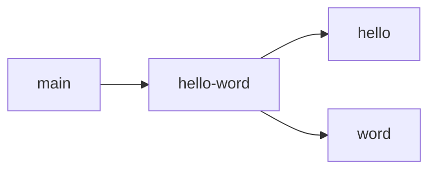
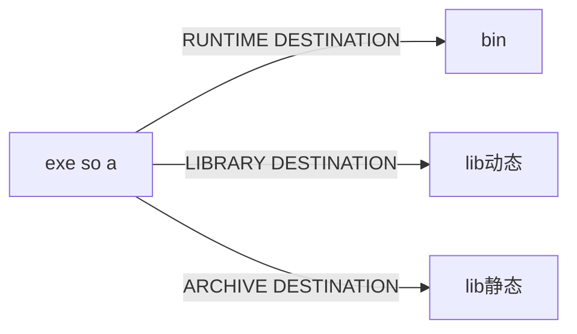
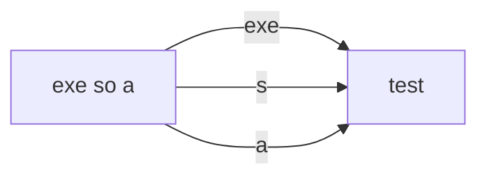

# cmake 学习笔记

## **cmake使用**
mkdir build  #创建存放生成文件的目录
cd bulid
cmake .. #后面加 . 是执行当前目录的cmakelists.txt,后面加 .. 是执行上一个目录下的cmakelists.txt。这条指令是生成makefile的。
make #即执行编译指令，生成库和可执行文件
make install #将生成的库和可执行文件按不同类型拷贝到 /usr/libs  /usr/include /usr/bin 等中去，这样就可以直接通过命令行用了

### **project指令**
    project(<项目名称>)
指定工程的名称
### **set指令**
    set(<variable> <value>... [PARENT_SCOPE])
用来设置变量，所有的value值带不带""都一样，都会被存储为value1;value2 这样的格式，用回车或者空格分开。
camke中使用变量时用 ${variable}来引用变量
### **message 指令**
message类似print，可以在屏幕上打印所需要的信息
### **关键词PRIVATE、INTERFACE、PUBLIC**
假设有链接关系如下图所示：

1.如果main不需要调用hello和word库里的函数，只需要hello-word，则用target_link_libraries(hello-word PRIVATE hello)
2.如果main需要调用hello和word里的函数，但是hello-word不需要调用，只用到了hello和word定义的结构体之类的，则用target_link_libraries(hello-word INTERFACE hello)
3.如果main和hello-word都需要调用hello和word里的函数，则用
target_link_libraries(hello-word PUBLIC hello)
### **add_executable指令**
    add_executable(<可执行文件> <源文件>... )
生成可执行文件
### **include_directories指令和target_include_directories指令**
    include_directories(<路径> <路径> ...)
    target_include_directories(<可执行文件名> <属性> <路径> <路径>...)
这两个命令都是给可执行文件指定头文件路径的，区别在于include_directories在调用这个指令之后的所有可执行文件和子工程下的可执行文件添加这个头文件路径，target_include_directories只给指定的可执行文件添加头文件路径。
### **add_library指令**
    add_library(<库名> <属性> <源文件> <源文件>)
生成库文件，其中属性这里可以控制生成的是动态库还是静态库，如果不给，默认为static，生成静态库，.a结尾。如果给SHARED,则生成动态库，.so结尾。静态库会直接和可执行文件在编译阶段就绑定，所以生成的文件较大。动态库在运行阶段才会和可执行文件绑定，所以生成的可执行文件较小，但是需要携带动态库才行。

    add_library(hello::library ALIAS hello_library)
这个指令是给创建的库指定一个别名，这样用别名时也指代该库。
### **link_directories指令**
    link_directories(<路径> <路径> ...)
指定要链接的库所在的路径，因为默认的查找路径是在/usr/libs和/usr/local/libs下所以，如果想用第三方库的话，就要指定第三方库所在的路径，这样可以直接在向可执行文件链接库的时候直接给相对路径，否则就要给绝对路径。
### **target_link_libraries指令**
    target_link_libraries(<可执行文件名>  <库名称> <库名称>)
要搭配上面的路径使用,这样可以直接给定库名称，如XXX.so文件。否则要添加库名称的绝对路径，如/XX/libs/xxx.so

### **install 指令**
    install(TARGETS MyLib #
        EXPORT MyLibTargets 
        LIBRARY DESTINATION lib  # 动态库安装路径
        ARCHIVE DESTINATION lib  # 静态库安装路径
        RUNTIME DESTINATION bin  # 可执行文件安装路径
        PUBLIC_HEADER DESTINATION include  # 头文件安装路径
    )
install指令类似于copy，他将生成的文件拷贝的指定的目录下。CMAKE_INSTALL_PREFIX是默认的根目录路径，unix下是usr/local/，如果不用/xxx/xxx指定绝对路径的话，xxx都是在根目录下的，如${CMAKE_INSTALL_PREFIX}/xxx。
install可以同时对多种类型文件进行处理，也可以对单独文件进行处理
例如 test 是可执行文件 libtest.so是动态库 libtest1.a是动态库

    install(TARGETS test libtest.so libtest1.a
    LIBRARY DESTINATION lib  # 动态库安装路径
    ARCHIVE DESTINATION lib  # 静态库安装路径
    RUNTIME DESTINATION bin  # 可执行文件安装路径
    )

这样install命令会将这三个文件按照分类拷到不同的目录。

TARGET 表示生成的目标文件，如exe,so,a等。
DIRECTORY 表示目录 这样后面可以跟目录。
FILES 表示文件 后面可以跟文件等，如.conf .xml .json。
这三个都可以作为install命令的开头。

DESTINATION 可以和LIBRARY等组合表示相应的文件类型的存放地点。也可以单独指定目标目录，这样的话，所有类型文件都会拷贝的指定的test目录，所有类型都是。

    install(TARGETS test libtest.so libtest1.a
       DESTINATION test  
    )

## **file相关指令**
file是针对文件相关操作的命令
### file(GLOB_RECURSE <variable> "*.so")
GLOB_RECURSE 会递归遍历当前目录及其子目录内的所有正则匹配上的文件，然后添加到变量中

## **list相关指令**
对于存储了多个东西的变量，都是列表
### list(APPEND ALL_TARGET_LIBRARIES ${OpenCV_LIBS})
添加${OpenCV_LIBS}到列表变量ALL_TARGET_LIBRARIES中
### list(REMOVE_ITEM ALL_SRCS ${REMOVE_CMAKE})
从 ALL_SRCS 中删除 ${REMOVE_CMAKE}中的东西

### **find_package指令**
    find_package(<PackageName> [version] [EXACT] [QUIET]
    [REQUIRED] [[COMPONENTS][组件名...]]
    )
例子：

    find_package(Boost 1.46.1 REQUIRED COMPONENTS filesystem system)
version和EXACT: 都是可选的，version指定的是版本，如果指定就必须检查找到的包的版本是否和version兼容。如果指定EXACT则表示必须完全匹配的版本而不是兼容版本就可以。

QUIET 可选字段，表示如果查找失败，不会在屏幕进行输出（但是如果指定了REQUIRED字段，则QUIET无效，仍然会输出查找失败提示语）。

MODULE 可选字段。前面提到说“如果Module模式查找失败则回退到Config模式进行查找”，但是假如设定了MODULE选项，那么就只在Module模式查找，如果Module模式下查找失败并不回落到Config模式查找。

REQUIRED可选字段。表示一定要找到包，找不到的话就立即停掉整个cmake。而如果不指定REQUIRED则cmake会继续执行。

COMPONENTS，components:可选字段，表示查找的包中必须要找到的组件(components），如果有任何一个找不到就算失败，类似于REQUIRED，导致cmake停止执行。

OPTIONAL_COMPONENTS和components：可选的模块，找不到也不会让cmake停止执行。
### **add_subdirectory(sublibrary1)**
    add_subdirectory(sublibrary1)
添加子工程。

